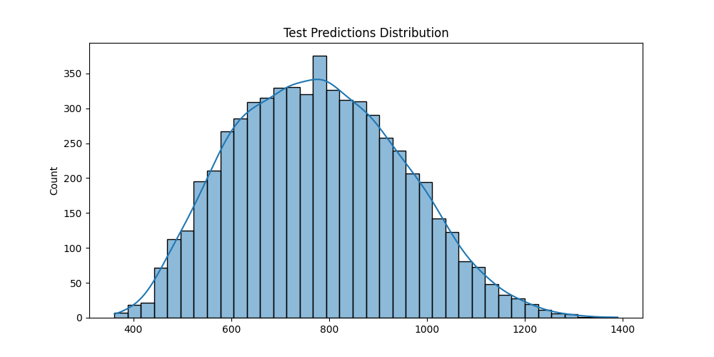

# Household Carbon Footprint Prediction

## Project Overview
This project develops a machine learning model to estimate the monthly carbon footprint of individual households based on lifestyle factors, household characteristics, energy consumption patterns, and sustainability practices. The goal is to provide personalized insights into carbon emissions, helping households identify ways to reduce their environmental impact.

## Problem Statement
Households are significant contributors to global carbon emissions, yet many people do not have a clear understanding of how their daily habits affect the environment. Traditional carbon footprint calculators often miss critical lifestyle factors. By using Machine Learning on household data, we can estimate carbon footprints more accurately, empowering individuals to make informed, climate-friendly choices.

## Dataset
The dataset contains information about households, including:
- Energy consumption (electricity, natural gas)
- Transportation patterns
- Household characteristics (size, area)
- Water usage
- Dietary preferences
- Sustainability practices (recycling, composting, etc.)

## Approach
The solution uses machine learning models to predict carbon footprints:

1. **Data Preprocessing**:
   - Handling missing values
   - Cleaning outliers and error codes
   - Standardizing numeric features
   - Encoding categorical variables

2. **Feature Engineering**:
   - Creating per-person metrics
   - Calculating energy efficiency measures
   - Developing sustainability scores
   - Generating combined energy usage metrics
   - Creating diet impact scores

3. **Modeling**:
   - Using XGBoost regressor as the primary model
   - Hyperparameter optimization

4. **Evaluation**:
   - R² score for determining model quality
   - RMSE (Root Mean Squared Error) for error measurement
   - Cross-validation for robust performance estimation

## Files in this Repository
- `carbon_footprint_model.py`: Implementation of the prediction model
- `requirements.txt`: Required Python packages
- `README.md`: Project documentation
- `dataset/`: Contains training and test data
  - `train.csv`: Training data
  - `test.csv`: Test data for predictions
  - `sample_submission.csv`: Sample submission format
- `output/`: Generated output files
  - `prediction_distribution.png`: Visualization of prediction distributions
  - `submission.csv`: Final predictions for submission

## How to Run the Code
1. Install the required packages:
   ```
   pip install -r requirements.txt
   ```

2. Run the model:
   ```
   python carbon_footprint_model.py
   ```

3. The model will:
   - Process and clean the data
   - Engineer new features
   - Train an XGBoost model
   - Generate predictions
   - Create a `submission.csv` file in the output directory

## Results
The model produces a R² score which measures how well the predictions explain the variation in carbon footprints. A score close to 1 indicates excellent predictive capability, while a score of 0 would indicate no predictive power beyond using the mean value.

## Output


